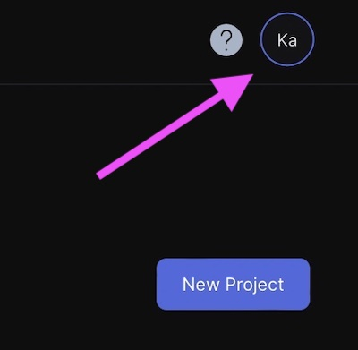
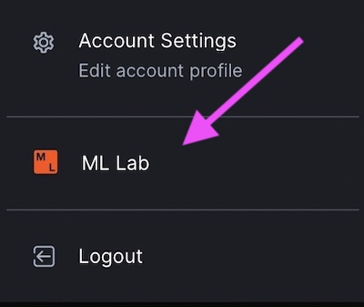
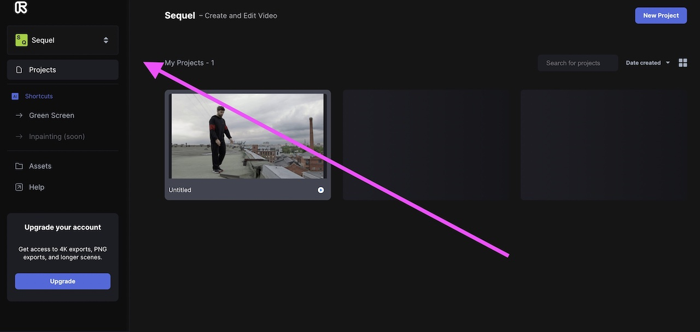
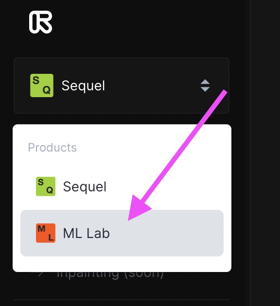
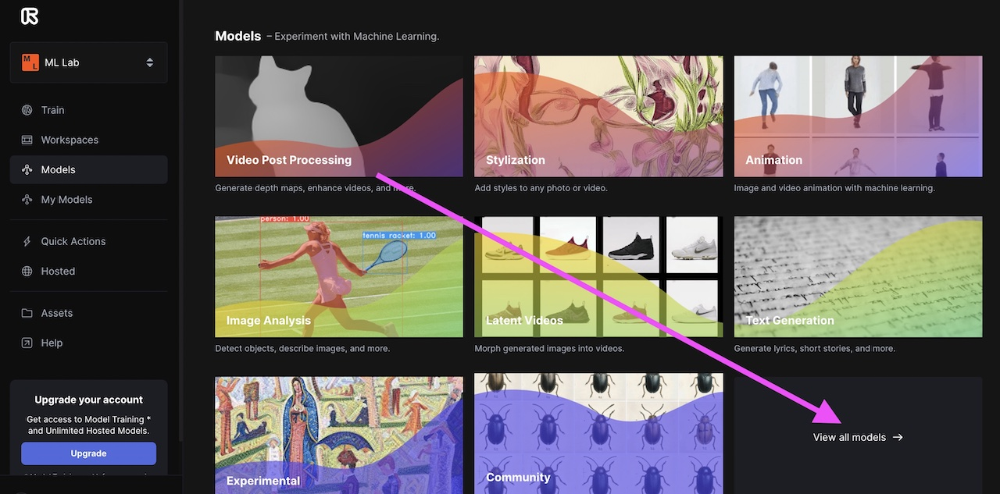
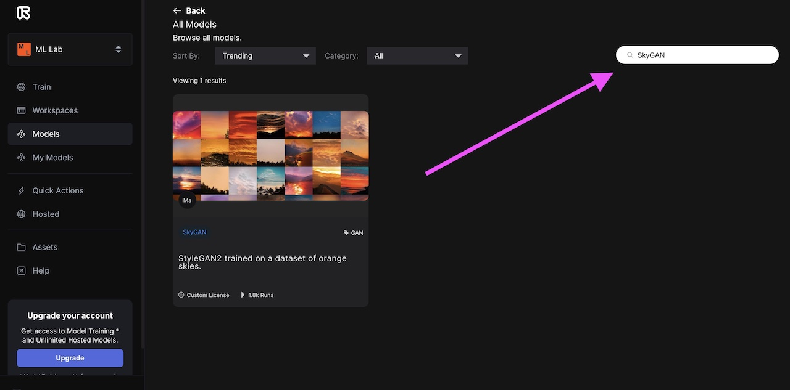
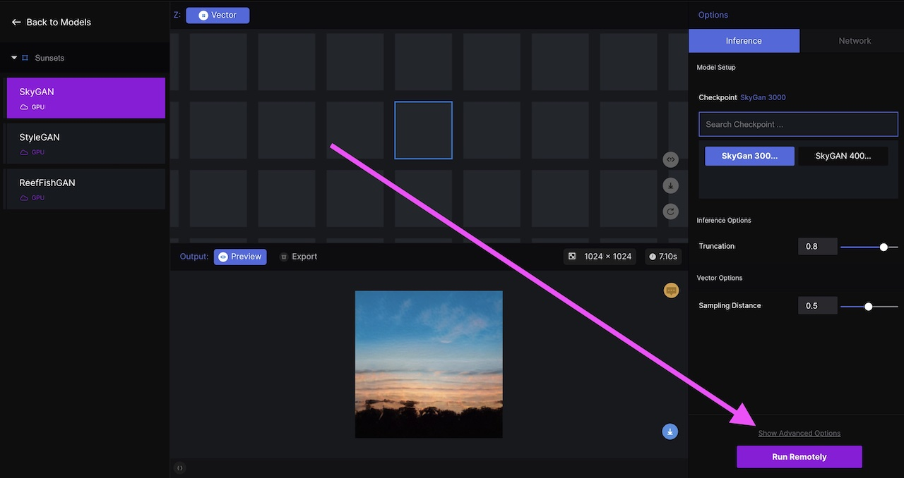
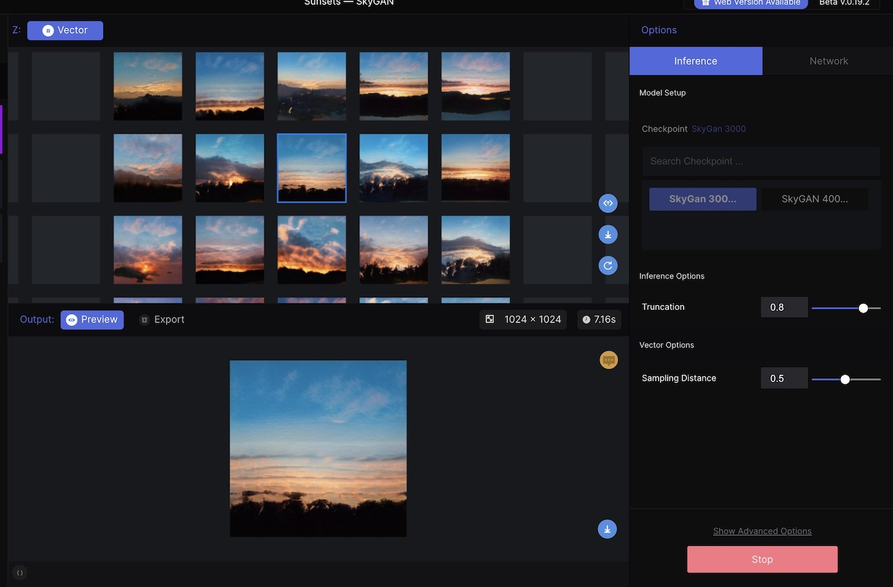
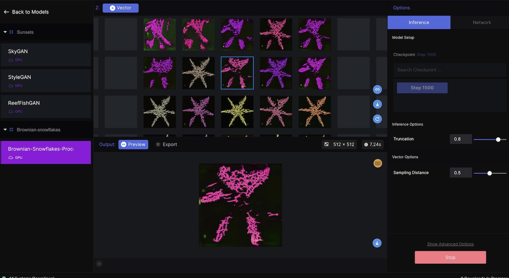

# AI SUNSETS

This work is based on the AI Rainbows Coding Challenge by Daniel Shiffman.  He used the "rainbows" checkpoint in his video.  Many more StyleGAN models have been added since the video was made (including some by Daniel--see below).  I decided to try out the SkyGAN model.

[AI Rainbows Coding Challenge] https://thecodingtrain.com/challenges/150-ai-rainbows-with-runway-and-p5js
[Link to p5.js sketch] https://editor.p5js.org/codingtrain/sketches/K6l0JbS6u

# AI Sunset Montage using RunwayML and SkyGAN

This sunset montage was created using an AI StyleGAN model called SkyGAN in the RunwayML app.

https://user-images.githubusercontent.com/65121394/185651438-db81b611-63aa-4ff5-87c8-9b5e67bdb03e.mp4

## About the SkyGAN model:

- StyleGAN2 was trained on a dataset of orange skies.
- Images gathered from r/skyporn, r/clouds, and Google Images.

- [Public Link to SkyGAN model] https://app.runwayml.com/models/madebyioo/SkyGAN

# Running RunwayML on the web

## Ceate a free acount with RunwayML  

- Note that there is a fee to upgrade to additional features.

- [RunwayML website] https://runwayml.com

## Once you have created your account, navigate to the ML Lab page

- Click on the account icon in upper right corner of menu.

- Click on ML Lab tab

    
- Follow the steps below to navigate to the SkyGAN model

# Running RunwayML locally

If you want to view the images in a p5.js sketch, you will need download the RunwayML app and have it running locally on your computer.  

- [RunwayML download page] https://runwayml.com/download/

Once you have the RunwayML app on your computer, here is how you can navigate to the SkyGan model:

- In main page, click on ↕️ next to Sequel in the upper left corner of the menu.

- Click on the ML Labs tab

- Click View All Models

- Search for the SkyGAN model

- Add the SkyGAN model to your workspace

- Once you have done that, choose Input: Vector and Run Remotely. 
 
 

 
- Wait for the vector to populate.  This will take a while.  Once it is populated, you can run the p5.js sketch to view the sunsets as Daniel Shiffman demonstrated in the video. 

 

# IMPORTANT!!

You can choose an image to download or export a mp4 file with the images in the RunwayML app. This will cost money.  When you sign up for an account, you get $10.00 in free credits.  You will need to purchase additional credits once the $10.00 is spent.  You can find out the estimated cost before you run the program.  

# There are now many models to choose from.  

- You can find more information about the available models in Browse Models.

- [RunwayML ML Lab page] https://app.runwayml.com/all-models

Here is an image of snowflakes generated by the Brownian snowflake model by Daniel Shiffman

 

